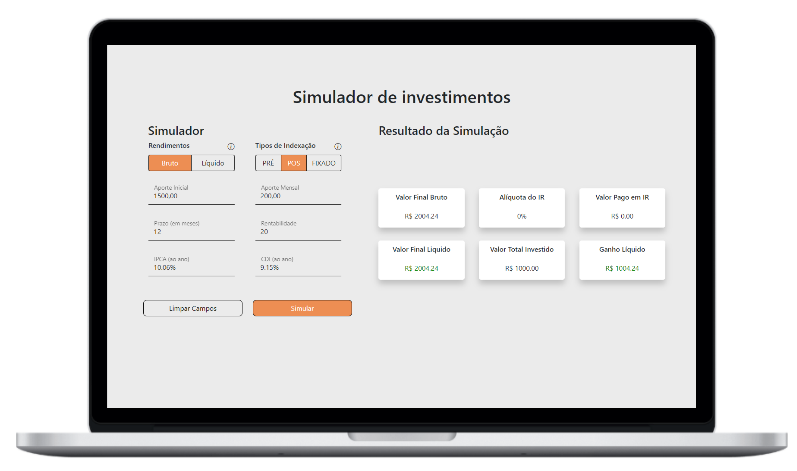
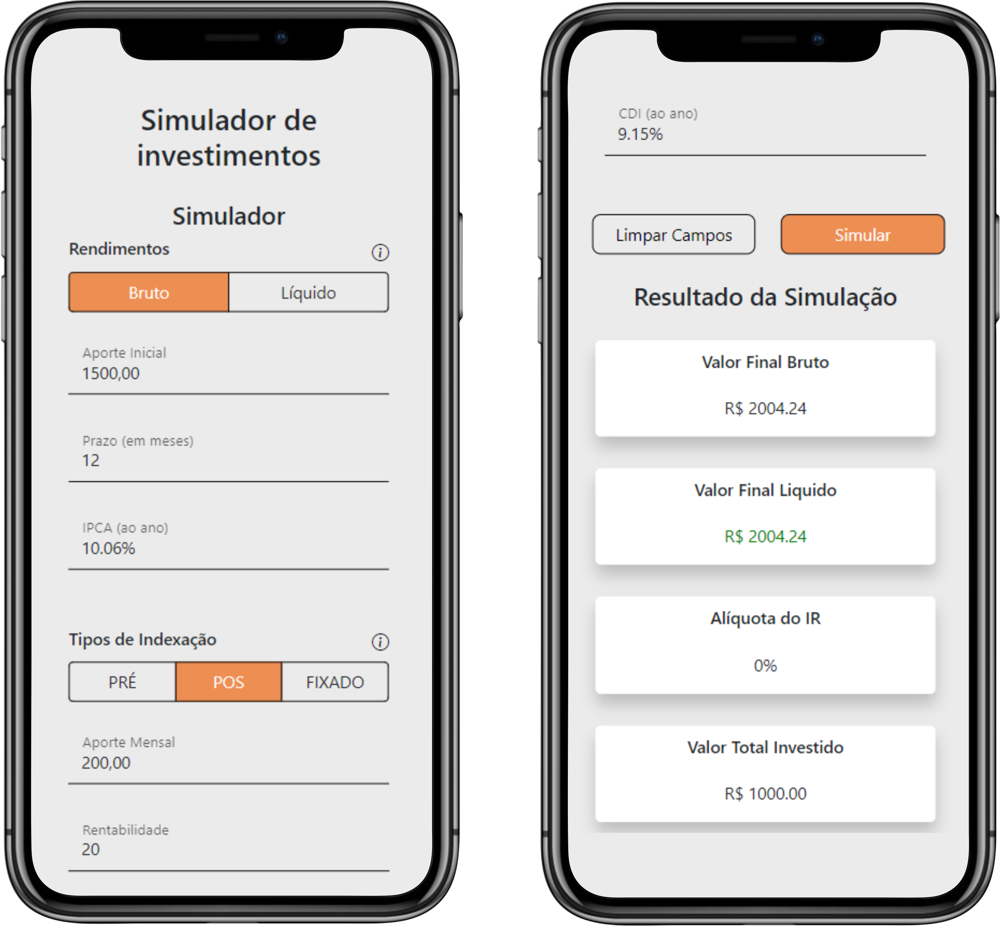

<h1 align="center" title="Simulador de Investimos">
    
     EQI | Simulador de investimentos
</h1>

    <a href="#-projeto">Projeto</a>&nbsp;&nbsp;&nbsp;|&nbsp;&nbsp;&nbsp;
    <a href="#-layout">Layout</a>&nbsp;&nbsp;&nbsp;|&nbsp;&nbsp;&nbsp;
    <a href="#-projeto">Tecnologias</a>&nbsp;&nbsp;&nbsp;|&nbsp;&nbsp;&nbsp;
    <a href="#-instalacao">Instalação</a>&nbsp;&nbsp;&nbsp;|&nbsp;&nbsp;&nbsp;
    <a href="#memo-licença">Licença</a>

 

## 💻 Projeto

Simulador de investimentos é um projeto desenvolvido com tecnologias front-end e consumindo um [API-fake](https://github.com/eqi-investimentos/desafio-fake-api) para o desafio tecnico frontend da EQI Investimentos.

## 🎨 Layout

    

 

    

## 🚀 Tecnologias

Este projeto foi desenvolvido com as seguintes tecnologias:

`CSS` - Ultilizado para a estilização de componentes HTML; 
`HTML` - Ultilizado para a criação de componentes; 
`Webpack` - Epacotador de codigos para otimização do projeto no ambiente de produção; 
`Bootstrap` - Framework de CSS para criação de Grids e regras de CSS sempre dando prioridade ao mobile-fist; 
`JavaScript` - Ultilizado para manipulação de DOM e para comunicação da API com o Front-end; 

## 🔰 Inicialização

1. Clone o **repositório**

- `https://github.com/VictorCrisostomo/simulador-de-investimentos.git`

2. Instale as dependências do projeto

- `npm install`

3. Navegue entre as pastas do repositório

- `./src/components/api`

4. E execute a instalação e a inicialização da API

- `npm install` e `npx json-server db.json`

### Ultilização

A aplicação está dividida em dois modos, `produção` (modo onde o projeto é otimizado e entregue ao cliente final) e `desenvolvimento` (modo onde é feita toda configuração e edição do codigo), com um servidor local instalado no modo de desenvolvimento fazendo a representação mais proxima do ambiente de produção.

Para navegar entre os modos: 

`npm run prod` - para acessar o modo de produção com o codigo otimizado;

`npm run dev` - para acessar o modo de desenvolvimento (ao executar esse comando ele inicializa o servidor na `http://localhost:8000/`);

## 📜 Licença

Esse projeto está sob a licença MIT. Veja o arquivo [LICENSE](LICENSE.MD) para mais detalhes.

---